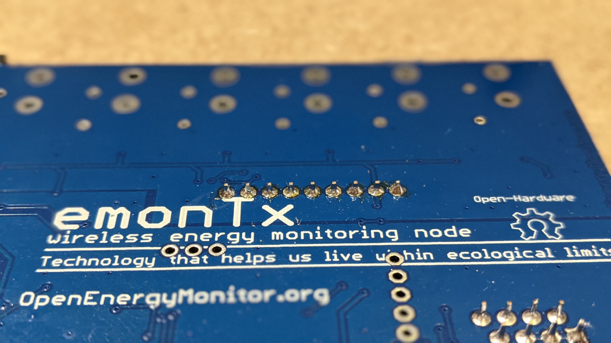
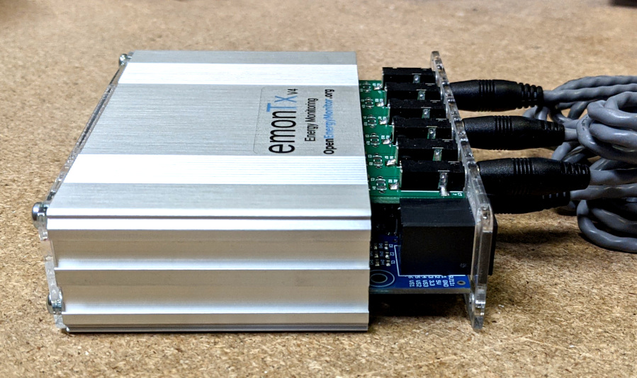
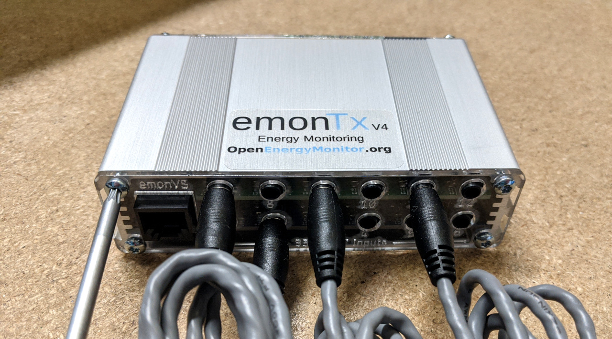

# 6 CT Expansion board

The 6 CT Expansion board adds a further 6x CT inputs to the EmonTx4, giving a total of 12 CT inputs. These can be used with example firmware that is provided as part of the new EmonLibDB library, supporting both single phase and 3 phase monitoring. 

**Note: Firmware configuration, compilation and upload required using the Arduino IDE.**

## Installation guide

**Upgrading:** If ordered separately to the EmonTx4 the expansion board comes with a 12 CT fascia to replace the standard 6 CT version. A 9-way header is also included that needs to be soldered in place on the EmonTx4.

Place the 9 way header on the top side of the board as circled below:

Solder the pins on the bottom side, taking care not to bridge across the pins:

**Note:** The mechanical attachment of the expansion board is not very secure. It relies on the 9 way PCB header connection. Care needs to be taken when plugging in expansion board CTs as the board can flex on the header. This is something we plan to improve on future versions.

We recommend connecting the CT sensors through the face plate, outside of the aluminium enclosure first and then attaching the face plate to the enclosure second. This ensures that the CT's are all fully inserted and that the pressure on the header is minimised. See pictures below.

Slide the emonTx4 board, expansion board, face plate and CT jacks into the case:

Screw in the torx screws (torx size T10):

## Firmware guide

The standard EmonTx4 firmware **does not support the 6 CT expansion board** and there are no pre-compiled firmwares available yet via the standard emonSD emoncms upload feature.

The firmware example that supports the 6 CT expansion board is available as part of the [EmonLibDB library](https://github.com/openenergymonitor/emonlibdb) and needs to be configured and uploaded to the EmonTx4 manually using the Arduino IDE. 

To do this:

1\. Start by following the existing [EmonTx4 How to compile and upload firmware guide](https://docs.openenergymonitor.org/emontx4/firmware.html#how-to-compile-and-upload-firmware). While the `EmonTx4DB_rf` firmware example does not use all of the libraries listed (it just needs emonLibDB and RFM69_LPL), it is worthwhile installing them all so that you have the capability to compile all EmonTx4 firmwares. 

2\. Using the Arduino IDE, open the `EmonTx4DB_rf` firmware example. Navigate to:

    File > Examples > emonLibDB > Examples > EmonTx4DB_rf
       

3\. With the example open, save as a new local copy e.g `EmonTx4DB_rf_mycopy`.

4\. Check that the EXPANSION_BOARD has been defined (line 33):

    #define EXPANSION_BOARD

5\. **Note that the Node ID for txPacket1 is set to 28 and txPacket2 is set to 29** (line 42, 61). If you have multiple EmonTx4 units, make sure that the NodeID's set here are unique on your system. Set as required.

6\. **Configure the emonVs voltage sensor calibration values** (lines 119-124). If you want to have 3 phase voltage sensing, make sure all 3 lines are present as default:

    EmonLibDB_set_vInput(1, 100.0, 0.16);  

    /* Include the next two lines if you have a 3-phase emonVS */

    EmonLibDB_set_vInput(2, 100.0, 0.16); 
    EmonLibDB_set_vInput(3, 100.0, 0.16); 
  
100.0 here refers to 100% of the default calibration value. 
Please see [emonLibDB user guide](https://github.com/openenergymonitor/emonLibDB/blob/main/guide.md) for more info as well 
0.16 refers to the voltage sensor phase calibration.

7\. **Configure the CT channel calibration values** (lines 126-140):

    EmonLibDB_set_cInput(1, 100.0, 0.3);         // 0.3° @ 20 A for 100 A CT
    EmonLibDB_set_cInput(2, 100.0, 0.3);
    EmonLibDB_set_cInput(3, 100.0, 0.3);
    EmonLibDB_set_cInput(4, 100.0, 0.3);
    EmonLibDB_set_cInput(5, 100.0, 0.3);
    EmonLibDB_set_cInput(6, 100.0, 0.3);

    EmonLibDB_set_cInput(7, 100.0, 0.3);
    EmonLibDB_set_cInput(8, 100.0, 0.3);
    EmonLibDB_set_cInput(9, 100.0, 0.3);
    EmonLibDB_set_cInput(10, 100.0, 0.3);
    EmonLibDB_set_cInput(11, 100.0, 0.3);
    EmonLibDB_set_cInput(12, 100.0, 0.3);

100.0 here refers to 100A CT sensors. If you have 20A or 50A CT sensors change the relevant channels to 20.0 or 50.0 to match the CT sensor. 
0.3 refers to the CT sensor phase calibration. 

8\. **Link voltage and current sensors to define the power & energy measurements** (lines 156-170). The default example is for a single phase setup with 12 CT sensors all on phase 1. 

    EmonLibDB_set_pInput(1, 1);
    EmonLibDB_set_pInput(2, 1);
    EmonLibDB_set_pInput(3, 1);
    EmonLibDB_set_pInput(4, 1);
    EmonLibDB_set_pInput(5, 1);
    EmonLibDB_set_pInput(6, 1);

    EmonLibDB_set_pInput(7, 1);
    EmonLibDB_set_pInput(8, 1);
    EmonLibDB_set_pInput(9, 1);
    EmonLibDB_set_pInput(10, 1);
    EmonLibDB_set_pInput(11, 1);
    EmonLibDB_set_pInput(12, 1);

These can be adjusted as required. Four sets of 3 phase measurements could look like this:

    EmonLibDB_set_pInput(1, 1);  // CT1, phase 1
    EmonLibDB_set_pInput(2, 2);  // CT2, phase 2
    EmonLibDB_set_pInput(3, 3);  // CT3, phase 3
    EmonLibDB_set_pInput(4, 1);
    EmonLibDB_set_pInput(5, 2);
    EmonLibDB_set_pInput(6, 3);

    EmonLibDB_set_pInput(7, 1);
    EmonLibDB_set_pInput(8, 2);
    EmonLibDB_set_pInput(9, 3);
    EmonLibDB_set_pInput(10, 1);
    EmonLibDB_set_pInput(11, 2);
    EmonLibDB_set_pInput(12, 3);

*Note: It is also possible to measure Line-Line loads, see Line-Line loads: example lines 175-188.*

9\. **Compile and upload your configured firmware to the EmonTx4.** Note compilation and upload settings as covered in the  [EmonTx4 How to compile and upload firmware guide](https://docs.openenergymonitor.org/emontx4/firmware.html#how-to-compile-and-upload-firmware). 

10\. **To receive the radio packet data on an emonPi or emonBase** first make sure that you are running LowPowerLabs radio firmware on the emonPi or emonBase receiver. 

If you have existing nodes running the original JeeLib classic radio format, the firmware on these will also need to be updated if everything is to continue talking to each other. 

If you have an emonPi make sure that it's running the latest emonPi LowPowerLabs firmware, this can be uploaded from the local emoncms Admin > Update page.

If you bought an emonBase alongside an emonTx4 and selected the standard radio format option the radio configuration should already be correct and ready to receive data from the EmonTx4 running the above firmware example.

11\. **Configure emonHub to decode the `EmonTx4DB_rf` radio packet**. 
If you have the latest version of emonhub with autoconf enabled, it will automatically populate the node decoder configuration below. If you have an older system with autoconf disabled, follow the following manual steps:

On your local emonPi/emonBase navigate to `Setup > Emonhub > Edit Config.`

If you already have a node configuration in the `[nodes]` section for the EmonTx4 under the same nodeid as above, remove this first. 

Add the following node decoder in its place (Adjust the nodeid to match the configured nodeid as set in the firmware above):

    [[28]]
        nodename = emonTx4_28
        [[[rx]]]
            names = MSG, Vrms1, Vrms2, Vrms3, P1, P2, P3, P4, P5, P6, E1, E2, E3, E4, E5, E6, pulse, Analog
            datacodes = L, h, h, h, h, h, h, h, h, h, l, l, l, l, l, l, L, H
            scales = 1.0, 0.01, 0.01, 0.01, 1.0, 1.0, 1.0, 1.0, 1.0, 1.0, 1.0, 1.0, 1.0, 1.0, 1.0, 1.0, 1.0, 1.0
            units = n, V, V, V, W, W, W, W, W, W, Wh, Wh, Wh, Wh, Wh, Wh, p, n

    [[29]]
        nodename = emonTx4_29
        [[[rx]]]
            names = MSG, Vrms2, Vrms3, P7, P8, P9, P10, P11, P12, E7, E8, E9, E10, E11, E12, digPulse, anaPulse
            datacodes = L, h, h, h, h, h, h, h, h, l, l, l, l, l, l, L, L
            scales = 1.0, 0.01, 0.01, 1.0, 1.0, 1.0, 1.0, 1.0, 1.0, 1.0, 1.0, 1.0, 1.0, 1.0, 1.0, 1.0, 1.0
            units = n, V, V, W, W, W, W, W, W, Wh, Wh, Wh, Wh, Wh, Wh, p, p

12\. **That should be it!** you should now see the EmonTx4 data appear both in the EmonHub log window and as inputs on the Emoncms inputs page :tada:

For more information, please see forum thread: [EmonTx4 3-phase support with emonLibDB](https://community.openenergymonitor.org/t/emontx4-3-phase-support-with-emonlibdb/23541)
